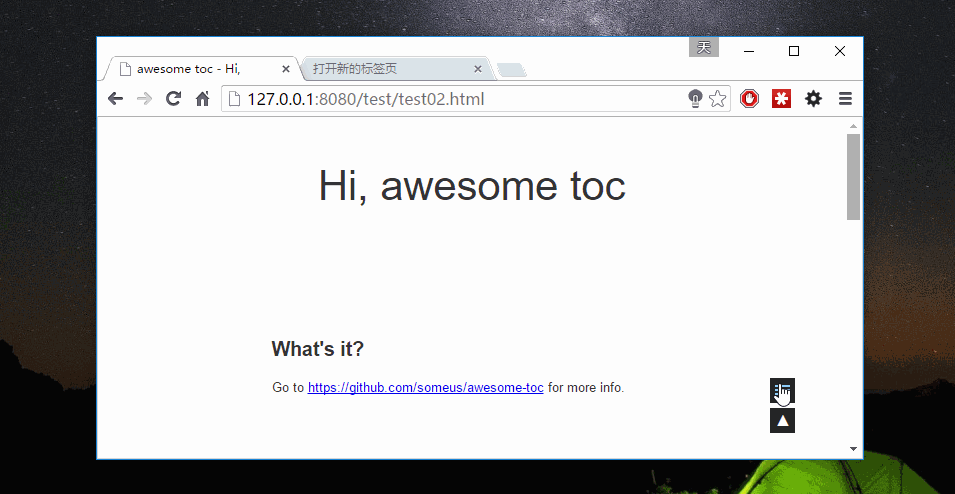
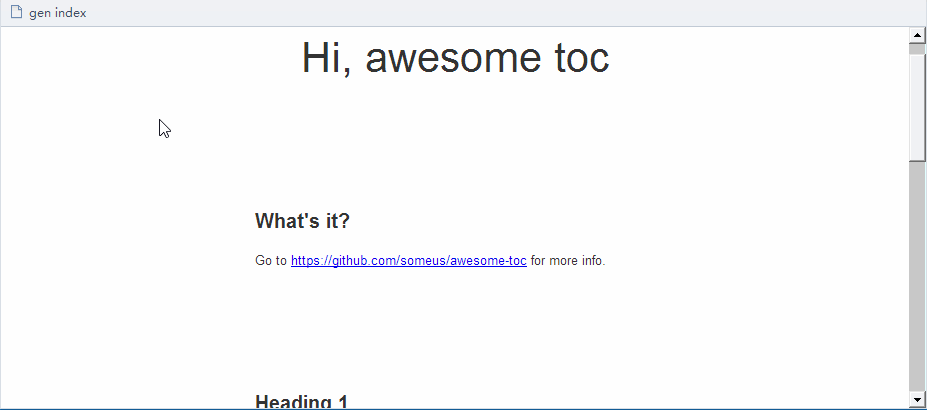

awesome toc
---

这是一个为网页生成目录的小工具，也支持回到顶部的功能。



## 用法

```js
<script type="text/javascript" src="/path/to/awesome-toc.min.js"></script>
<script type="text/javascript">
    $.awesome_toc({        
      autoDetectHeadings: true,
      enableToTopButton: true,
      title: "INDEX",
      css: {
          fontSize: "14px",
          largeFontSize: "18px",
      },
    });
</script>
```


## 依赖
jQuery。

在jquery 1.11和jquery 2.0中测试通过。

## 配置项

| 属性        | 类型           | 说明  |
| ------------- |-------------|--------|
| col 3 is      | right-aligned | $1600 |
| col 2 is      | centered      |   $12 |
| zebra stripes | are neat      |    $1 |


## 小书签

在浏览器中创建书签，url使用下面的内容：

```js
javascript:(function(){var a=function(a){var b=document.createElement("script");b.setAttribute("src",a+"?time="+Date.parse(new Date)),document.body.appendChild(b)};a("http://hi.letiantian.me/toc/loader.min.js")})();
```




## 其他

界面设计上参考了[hexo-theme-next](https://github.com/iissnan/hexo-theme-next)。

目前的小书签托管在github的pages服务中，在https的网站中使用可能会遇到“已阻止载入混合活动内容”这类问题。


